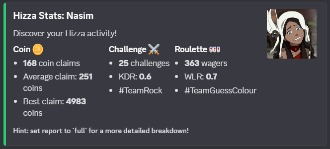
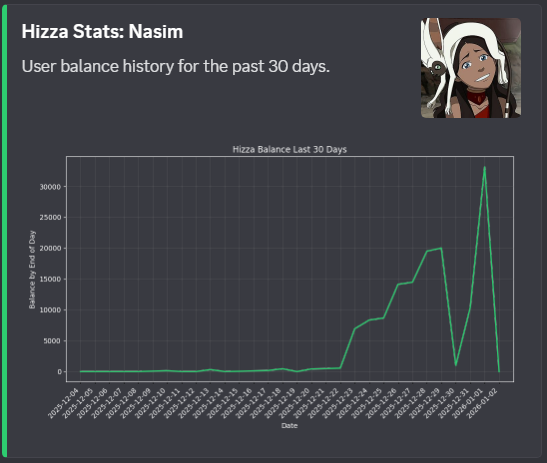
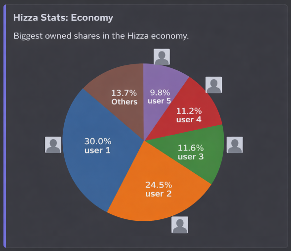

# HizzaStats
HizzaStats is a [Hizza](https://github.com/Android2771/hizza) economy  companion Discord bot for user and community statistics.

## Features
### `/stats`
Displays given user's statistics based on Hizza activity (coin claim, challenges, and roulette). Default mode is `compact`.

### `/balancehistory user`
Displays a line plot of the given user's balance history depending on `mode`. Current modes:
- `l30days` (default): Balance at the end of day for the last 30 days (including today).
- `l100transactions`: Balance after every transactions for the past 100 transactions (plus current balance).

### `/balancehistory top5`
Displays a line plot of the user balance history at the end of the day for the last 30 days for the current top 5 users on the coin leaderboard.

### `/economy`
Displays a pie chart of the current biggest shares of the Hizza economy.

### `/nextdestiny`
Returns the date for the next insane destiny day.